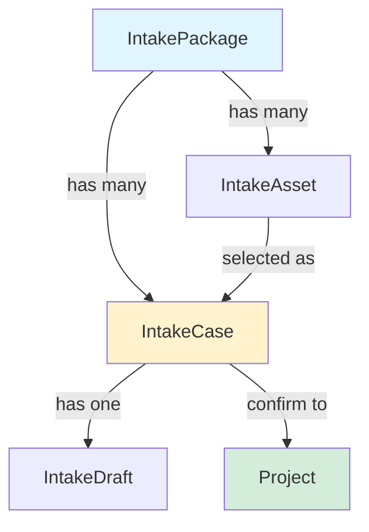
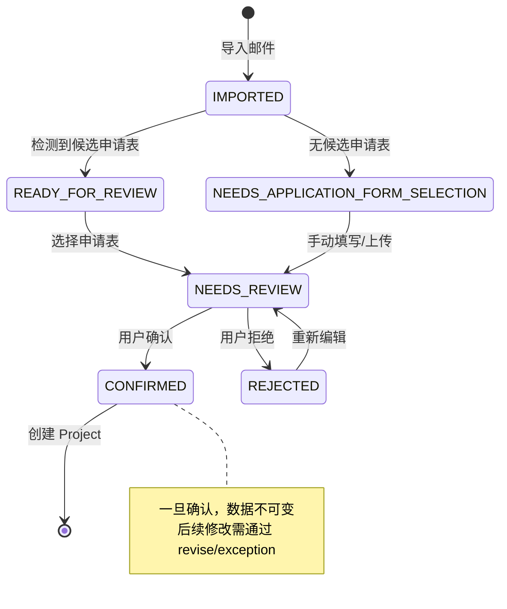

# New Project 导入邮件逻辑分析与矛盾评估报告

**文档版本**: v1.0  
**创建日期**: 2026-05-12  
**分析范围**: New Project 邮件导入后的完整业务流程  
**审核状态**: 待专家审核  

---

## 📋 执行摘要

本文档详细分析了 ConnLab 项目中 New Project 功能在导入邮件（`.msg`）后的完整业务逻辑流程，识别出 **5 个潜在的逻辑矛盾和设计问题**，并提供了修复建议。

### 核心发现

1. ✅ **整体架构设计合理**：分层清晰，职责明确
2. ⚠️ **存在 5 个逻辑矛盾**：其中 2 个为高优先级，需要立即修复
3. 🔴 **用户体验问题**：重复确认对话框影响操作流程
4. 📊 **数据一致性风险**：可能导致数据库冗余和人工修改丢失

---

## 🎯 一、New Project 导入邮件的完整逻辑流程

### 1.1 核心概念

**New Project 流程采用"单页流"设计**，分为四个阶段：

```
Intake (收件) → Precheck (预检) → LTR (登记) → Folder (文件夹)
```

**关键领域对象**：

| 对象 | 说明 | 生命周期 |
|------|------|---------|
| `IntakePackage` | 邮件包，包含源邮件和所有附件 | 导入时创建，Project 确认后保留 |
| `IntakeAsset` | 附件资产，每个文件一个记录 | 跟随 Package |
| `IntakeCase` | 申请案例，一个 Package 可有多个 Case | 选中申请表时创建，Confirm 后不可变 |
| `IntakeDraft` | 草稿数据，存储解析结果和人工修改 | 跟随 Case，可多次更新 |
| `Project` | 正式项目，由 Case Confirm 生成 | 一旦创建，数据固化 |

### 1.2 两种导入入口

#### 入口 A：通过 `.msg` 文件导入（主要路径）

```
用户上传 .msg 
  → MsgPackageIntakeService.import_msg_package()
  → OfficeFacade.import_outlook_msg() 解析邮件
  → 提取元数据（主题、发件人、收件人、时间、正文）
  → 提取附件列表
  → 存储到 data/intake/{package_id}/
  → 创建 IntakePackage 记录
  → 为每个附件创建 IntakeAsset 记录
  → ApplicationFormCandidateDetector 检测候选申请表
  → 返回 package + assets + candidates
```

**存储结构**：

```
data/intake/{package_id}/
  ├── source/
  │   └── original.msg          # 原始邮件文件
  └── attachments/
      ├── attachment_1.docx     # Word 申请表(候选)
      ├── attachment_2.pdf      # PDF 规格书
      ├── attachment_3.xlsx     # Excel 文件
      └── ...
```

#### 入口 B：直接上传 `.docx` 申请表（快速路径）

```
API: POST /api/intake-packages/import-docx
  → 跳过邮件解析
  → 自动创建虚拟 Package
  → 直接标记为 SELECTED_APPLICATION_FORM
  → 适用于已知申请表文件的场景
```

---

### 1.3 导入后的多种情况处理

#### 情况分类矩阵

| 情况 | 触发条件 | 处理方式 | 用户操作 |
|------|---------|---------|---------|
| **A. 全新邮件** | 首次导入该邮件 | 正常流程 | 选择申请表 → 编辑 → 确认 |
| **B. 重复邮件 + 相同申请表** | 同一封邮件已存在未确认草稿 | 检测到重复 | 选择"打开现有"或"替换现有" |
| **C. 重复邮件 + 不同申请表** | 同一封邮件但选择了不同的 Word 文件 | 视为新 Case | 创建新的 Case/Draft |
| **D. 无申请表候选** | 邮件中没有 .docx 文件 | 创建空白草稿 | 手动填写或稍后导入申请表 |
| **E. 多次导入同一邮件** | 多次导入同一 .msg 文件(SHA256 匹配) | 强制去重 | 必须选择处理方式 |

---

### 1.4 详细情况解析

#### ✅ 情况 A：全新邮件 (Happy Path)

**触发条件**：
- 邮件 SHA256 哈希值在系统中不存在

**处理流程**：

```python
# 1. 导入邮件
package = create IntakePackage(status=READY_FOR_REVIEW)
assets = create IntakeAsset for each attachment

# 2. 检测候选申请表
candidates = detect_candidates(package_id)
  ├─ 有候选 → status = READY_FOR_REVIEW
  └─ 无候选 → status = NEEDS_APPLICATION_FORM_SELECTION

# 3. 前端展示
IntakeInboxPage 显示:
  - 左侧: Email information (发件人、主题、日期)
  - 左侧: Attachments 列表(可点击选择)
  - 右侧: Attachment details 预览区

# 4. 用户选择申请表
用户点击某个 .docx 附件行
  → 右侧显示结构化预览(字段、样品表、测试要求)
  → 点击 "Continue" 进入 Precheck
  → 后端调用 select_form_asset() 创建 Case 和 Draft
```

---

#### ⚠️ 情况 B：重复邮件 + 相同申请表

**触发条件**：

```python
# 系统检测到:
- 新导入的 .msg SHA256 == 已存在的 .msg SHA256
- 且选择的 .docx 文件名 == 已存在的 .docx 文件名
- 且已存在的 Case 状态 ≠ CONFIRMED (未确认成 Project)
```

**检测位置**：[`IntakeFormSelectionService._find_selected_form_duplicate()`](file:///D:/PythonProject/connlab/backend/application/intake_form_selection_service.py#L216-L254)

**处理流程**：

```python
# 1. 导入时不立即报错
import_msg_package() 成功,创建新 package

# 2. 当用户选择申请表时触发检测
select_form_asset(asset_id)
  ↓
duplicate = _find_selected_form_duplicate(package, asset)
  ↓
if duplicate is not None:
  raise IntakeDraftDuplicateResolutionRequiredError(duplicate)
```

**前端响应**：

```typescript
// IntakeInboxPage.tsx 捕获异常
try {
  await selectIntakeApplicationForm(asset_id);
} catch (error) {
  if (error.isDuplicateDraft) {
    setDuplicateDraft({
      check: error.duplicateCheck,
      packageId: error.packageId
    });
  }
}

// 显示 Duplicate Card
<DuplicateDraftCard
  classification={check.classification}  // "exact_existing_application_draft"
  existingSourceName={check.existing_source_original_name}
  incomingSourceName={check.incoming_source_original_name}
  existingFormName={check.existing_application_form_name}
  onOpenExisting={() => handleResolution("open_existing")}
  onReplaceExisting={() => handleResolution("replace_existing")}
/>
```

**用户可选操作**：

| 选项 | 行为 | 适用场景 |
|------|------|---------|
| **Open existing draft** | 跳转到已有的 Case/Draft | 继续之前的工作 |
| **Replace existing draft** | 删除旧 Package/Case/Draft,使用新的 | 重新导入更新的邮件 |
| **Create separate** | (当前不支持) 创建独立副本 | - |

**后端处理**：

```python
# open_existing
_resolve_duplicate(action="open_existing")
  ↓
# 返回已有的 FormSelectionResult
return FormSelectionResult(
  package_id=duplicate.existing_package_id,
  case=existing_case,
  draft=existing_draft,
  selected_asset=existing_asset
)

# replace_existing
_resolve_duplicate(action="replace_existing")
  ↓
_delete_package_records(duplicate.existing_package_id)
  ├─ draft_store.delete_by_package()
  ├─ case_store.delete_by_package()
  ├─ asset_store.delete_by_package()
  └─ package_store.delete()
  ↓
# 继续创建新的 Case/Draft
```

---

#### 🆕 情况 C：重复邮件 + 不同申请表

**触发条件**：

```python
# 邮件相同(SHA256 匹配)
# 但选择的 .docx 文件名不同
existing_form.original_name != selected_asset.original_name
```

**处理逻辑**：

```python
# _find_selected_form_duplicate() 返回 None
# 因为文件名不匹配
duplicate = None

# 继续正常流程
_create_or_update_case(package_id, selected_asset_id)
  ↓
# 检查是否有可复用的 Case
for case in existing_cases:
  if case.selected_form_asset_id == selected_asset_id:
    # 复用同一个资产的 Case
    return update case status to NEEDS_REVIEW
    
# 否则创建新 Case
create new IntakeCase(
  case_id="case-{uuid}",
  package_id=package_id,
  selected_form_asset_id=asset_id,
  status=NEEDS_REVIEW
)
```

**业务意义**：
- 允许同一封邮件对应多个不同的申请表(例如多个产品)
- 每个申请表生成独立的 Case
- 最终可以 confirm 成多个独立的 Project

---

#### 📝 情况 D：无申请表候选

**触发条件**：

```python
# 邮件中没有 .docx 文件
# 或所有 .docx 都被标记为 ineligible
candidates = []
package.status = NEEDS_APPLICATION_FORM_SELECTION
```

**处理流程**：

```python
# 1. 导入成功,但标记需要选择申请表
import_msg_package() returns with status=NEEDS_APPLICATION_FORM_SELECTION

# 2. 前端进入 New Project 编辑器
ensureNewProjectApplicationDraft(package_id)
  ↓
# NewProjectApplicationDraftService.ensure_draft()
_auto_select_application_form(package_id)
  ↓
# 尝试自动选择最高优先级的 .docx
for asset in candidates:
  try:
    selection = select_form_asset(package_id, asset.asset_id)
    return selection.case, selection.draft
  except IntakeSelectionError:
    continue  # 跳过不合格的文档

# 3. 如果没有合格的 .docx,创建空白草稿
_create_or_reuse_blank_draft(package_id)
  ↓
create IntakeCase(selected_form_asset_id=None)
create IntakeDraft(parsed_fields_json="{}")
```

**前端展示**：

```typescript
// IntakeInboxPage 显示空白编辑器
<NewProjectApplicationEditor
  fields={[]}  // 空字段列表
  sampleRows={[emptyPrecheckSampleRow()]}
  requestedTestingRows={[emptyPrecheckRequestedTestingRow()]}
/>

// 用户可以:
// 1. 手动填写所有字段
// 2. 点击 "Upload application form" 导入 .docx
// 3. 稍后从附件列表中选择
```

---

#### 🔁 情况 E：多次导入同一邮件

**触发条件**：

```python
# 用户多次上传同一个 .msg 文件
# SHA256 完全匹配
existing_source.sha256 == incoming_source.sha256
existing_source.size_bytes == incoming_source.size_bytes
```

**特殊处理**：

```python
# 在 ensure_draft() 中检测
_find_no_form_duplicate(package)
  ↓
# 即使没有选择申请表,也检测邮件级别的重复
for existing_package in all_packages:
  existing_source = get_email_source(existing_package)
  if _same_email_source(existing_source, incoming_source):
    for case in existing_package.cases:
      if case.selected_form_asset_id is None:  # 无表单草稿
        return IntakeDraftDuplicateCheck(
          classification="exact_existing_no_form_draft",
          ...
        )
```

---

## 🔴 二、发现的逻辑矛盾与问题

### 矛盾 1: `replace_existing` 在同一 Package 内的行为不一致

**严重程度**: 🔴 高  
**影响范围**: Draft 初始化逻辑  
**文件位置**: [`intake_form_selection_service.py:180-206`](file:///D:/PythonProject/connlab/backend/application/intake_form_selection_service.py#L180-L206)

#### 问题描述

```python
# Line 180-184
duplicate = self._find_selected_form_duplicate(package, asset)
reinitialize_same_package_draft = (
    duplicate is not None
    and duplicate.existing_package_id == package.package_id  # ⚠️ 同一 Package
    and resolution_action == "replace_existing"
)

# Line 186-194
if duplicate is not None:
    resolved = self._resolve_duplicate(
        duplicate,
        resolution_action,
        resolution_case_id,
        package.package_id,
    )
    if resolved is not None:
        return resolved  # ⚠️ 如果返回了，下面的代码不会执行

# Line 195-207 - 这段代码在什么情况下执行？
selected_asset = self._asset_store.update(...)
case_selection = self._create_or_update_case(...)
draft = self._create_or_update_draft(
    ...,
    reinitialize=reinitialize_same_package_draft,  # ⚠️ 这个标志何时生效？
)
```

#### 矛盾点分析

1. **如果检测到重复且 `resolution_action="replace_existing"`**:
   - `_resolve_duplicate()` 在 Line 274-279 会删除旧的 Package 记录并返回 `None`
   - 然后继续执行 Line 195-207，创建新的 Case/Draft
   
2. **但是**，如果 `duplicate.existing_package_id == current_package_id`（同一 Package）:
   - Line 275-276: `_resolve_duplicate()` 直接返回 `None`，**不删除任何内容**
   - 然后继续执行 Line 195-207
   - 此时 `reinitialize_same_package_draft=True`，会重新初始化 Draft

3. **问题**: 
   - 为什么需要两个不同的路径来处理"同一 Package 内替换"？
   - Line 275-276 的早期返回与 Line 181-184 的 `reinitialize_same_package_draft` 标志是否冗余？

#### 建议修复

```python
# 方案 A: 统一处理逻辑
if duplicate is not None:
    if duplicate.existing_package_id == package.package_id:
        # 同一 Package 内替换，只重新初始化 Draft
        if resolution_action == "replace_existing":
            selected_asset = self._asset_store.update(
                replace(asset, asset_role=IntakeAssetRole.SELECTED_APPLICATION_FORM)
            )
            case_selection = self._create_or_update_case(package.package_id, selected_asset.asset_id)
            draft_payload, parser_warnings = self._parse_selected_asset(selected_asset)
            draft = self._create_or_update_draft(
                case_selection.case.case_id,
                draft_payload,
                parser_warnings,
                keep_manual_overrides=False,
                reinitialize=True,  # 强制重新初始化
            )
            return FormSelectionResult(...)
    else:
        # 不同 Package，执行标准的重复解决流程
        resolved = self._resolve_duplicate(...)
        if resolved is not None:
            return resolved

# 正常流程（无重复或 create_separate）
...
```

---

### 矛盾 2: `_auto_select_application_form` 可能触发未处理的重复异常

**严重程度**: 🔴 高  
**影响范围**: 用户体验，页面加载逻辑  
**文件位置**: [`new_project_application_draft_service.py:204-210`](file:///D:/PythonProject/connlab/backend/application/new_project_application_draft_service.py#L204-L210)

#### 问题描述

```python
for asset in candidates:
    try:
        selection = self._selection_service.select_form_asset(
            package_id,
            asset.asset_id,
        )
    except IntakeDraftDuplicateResolutionRequiredError:
        raise  # ⚠️ 直接抛出，没有传递 resolution_action
    except (IntakeSelectionError, IntakeSelectionNotFoundError) as exc:
        logger.info(...)
        continue
    return selection.case, selection.draft
```

#### 矛盾点分析

1. **调用链**:
   ```
   ensure_draft() 
     → _auto_select_application_form()
       → select_form_asset()  ← 可能抛出 IntakeDraftDuplicateResolutionRequiredError
   ```

2. **问题**: 
   - `ensure_draft()` 在 Line 129 调用 `_auto_select_application_form()` 时**没有传递** `resolution_action`
   - 如果自动选择触发了重复检测，会立即抛出异常
   - 但此时用户还没有机会看到重复决策卡片（因为这是后台自动操作）

3. **场景重现**:
   ```
   1. 用户导入邮件 A，选择了申请表 X，创建了 Draft
   2. 用户刷新页面或重新进入 New Project
   3. ensure_draft() 被调用，尝试自动选择申请表 X
   4. select_form_asset() 检测到重复，抛出 IntakeDraftDuplicateResolutionRequiredError
   5. 前端收到异常，但用户并没有主动选择操作，只是打开了页面
   ```

#### 建议修复

```python
def _auto_select_application_form(
    self, package_id: str
) -> tuple[IntakeCase, IntakeDraft] | None:
    """Select the highest-ranked candidate form when the editor opens blank."""
    if self._assets is None or self._selection_service is None:
        return None
    
    # 先检查是否有可复用的 Case
    reusable_case = self._reusable_case(package_id)
    if reusable_case is not None and reusable_case.selected_form_asset_id is not None:
        # 已经有选中的表单，直接返回现有 Draft
        draft = self._drafts.get_by_case(reusable_case.case_id)
        if draft is not None:
            return reusable_case, draft
    
    candidates = [
        asset
        for asset in self._assets.list_by_package(package_id)
        if self._is_word_document(asset)
    ]
    
    for asset in candidates:
        try:
            # 传递 resolution_action=None，让重复检测静默失败
            selection = self._selection_service.select_form_asset(
                package_id,
                asset.asset_id,
                resolution_action="create_separate",  # ⚠️ 关键修改：避免触发异常
            )
        except IntakeDraftDuplicateResolutionRequiredError:
            # 遇到重复，跳过此候选，尝试下一个
            logger.info(
                "auto_select_skipped_duplicate",
                extra={"package_id": package_id, "asset_id": asset.asset_id}
            )
            continue
        except (IntakeSelectionError, IntakeSelectionNotFoundError) as exc:
            logger.info(...)
            continue
        return selection.case, selection.draft
    
    return None
```

---

### 矛盾 3: 重复检测的时间点不一致

**严重程度**: 🟡 中  
**影响范围**: 数据库冗余  
**文件位置**: 多处

#### 问题描述

| 检测位置 | 触发时机 | 检测类型 |
|---------|---------|---------|
| `MsgPackageIntakeService.import_msg_package()` | 导入邮件时 | ❌ **不检测** |
| `NewProjectApplicationDraftService.ensure_draft()` | 打开编辑器时 | ✅ 检测无表单重复 |
| `IntakeFormSelectionService.select_form_asset()` | 选择申请表时 | ✅ 检测有表单重复 |

#### 矛盾点分析

1. **导入邮件时不检测重复**:
   ```python
   # msg_package_intake_service.py:100-104
   if resolution_action is not None or resolution_package_id is not None:
       self._storage.delete_package(package_id)
       raise MsgPackageIntakeError(
           "Email package duplicate resolution now happens when a draft is created."
       )
   ```
   - 注释说"重复解决在创建 Draft 时发生"
   - 但实际上每次导入都会创建新的 Package，即使邮件完全相同

2. **可能导致的问题**:
   ```
   用户连续导入同一封邮件 3 次
     → 创建 3 个不同的 Package (pkg-1, pkg-2, pkg-3)
     → 每个 Package 都有相同的 .msg 源文件和附件
     → 数据库中存在大量重复数据
   ```

3. **当前的去重机制依赖后续操作**:
   - 只有当用户选择申请表或打开编辑器时才会检测到重复
   - 如果用户导入了邮件但从未操作，重复数据会一直存在

#### 建议修复

在 `import_msg_package()` 中添加预检测：

```python
def import_msg_package(
    self,
    filename: str,
    source: BinaryIO,
    resolution_action: str | None = None,
    resolution_package_id: str | None = None,
) -> MsgPackageIntakeResult:
    """Import an uploaded `.msg` file and register extracted attachments."""
    
    # ⚠️ 新增：预先检测重复邮件
    safe_name = self._safe_msg_filename(filename)
    
    # 计算上传文件的 SHA256
    with TemporaryDirectory(prefix="connlab-msg-import-") as directory:
        uploaded_path = Path(directory) / safe_name
        with uploaded_path.open("wb") as handle:
            shutil.copyfileobj(source, handle)
        
        incoming_sha256 = self._storage.sha256(uploaded_path)
        incoming_size = uploaded_path.stat().st_size
        
        # 检查是否已存在相同的邮件
        existing_package = self._find_duplicate_package(incoming_sha256, incoming_size)
        if existing_package is not None:
            # 可选策略 A: 直接返回已有的 Package
            assets = self._asset_store.list_by_package(existing_package.package_id)
            candidates = ApplicationFormCandidateDetector(self._asset_store).detect_for_package(
                existing_package.package_id
            )
            return MsgPackageIntakeResult(
                package=existing_package,
                assets=tuple(assets),
                candidates=detection.candidates,
                duplicate_check=IntakeDraftDuplicateCheck(...),  # 提供重复信息
            )
            
            # 可选策略 B: 抛出异常，要求用户确认
            # raise MsgPackageIntakeError("Duplicate email detected...")
    
    # 原有逻辑继续...
```

---

### 矛盾 4: `keep_manual_overrides` 的逻辑不完整

**严重程度**: 🟡 中  
**影响范围**: 人工修改数据丢失风险  
**文件位置**: [`intake_form_selection_service.py:204-205`](file:///D:/PythonProject/connlab/backend/application/intake_form_selection_service.py#L204-L205)

#### 问题描述

```python
draft = self._create_or_update_draft(
    case_selection.case.case_id,
    draft_payload,
    parser_warnings,
    keep_manual_overrides=case_selection.same_selected_asset
    and not replace_existing,  # ⚠️ 条件可能不充分
    reinitialize=reinitialize_same_package_draft,
)
```

#### 矛盾点分析

1. **当前逻辑**:
   - `keep_manual_overrides = same_selected_asset AND NOT replace_existing`
   - 意思是：如果是同一个资产且不是替换操作，则保留人工修改

2. **遗漏的场景**:
   ```
   场景 1: 用户选择资产 A → 修改字段 → 切换到资产 B → 再切换回资产 A
     - 第一次选择 A: same_selected_asset=False, 创建新 Draft
     - 切换到 B: 清除 A 的 manual_overrides
     - 切换回 A: same_selected_asset=False (因为 Case 可能不同了?), 再次清除
   
   场景 2: 用户在同一个 Case 内多次解析同一个资产
     - 第一次: same_selected_asset=True, keep_manual_overrides=True ✅
     - 第二次: same_selected_asset=True, keep_manual_overrides=True ✅
     - 但如果中间有其他操作呢？
   ```

3. **更合理的判断标准**:
   - 应该基于 **Case ID 是否相同** + **Asset ID 是否相同**
   - 而不是仅仅依赖 `same_selected_asset` 标志

#### 建议修复

```python
def _create_or_update_case(self, package_id: str, selected_asset_id: str) -> _CaseSelection:
    existing_cases = self._case_store.list_by_package(package_id)
    for current in existing_cases:
        if (
            current.selected_form_asset_id == selected_asset_id
            and self._can_reuse_case(current)
        ):
            return _CaseSelection(
                case=self._case_store.update(
                    replace(
                        current,
                        status=IntakeCaseStatus.NEEDS_REVIEW,
                        confirmed_project_id=None,
                    )
                ),
                same_selected_asset=True,
            )
    
    # ⚠️ 新增：检查是否有其他 Case 使用了相同的资产
    for current in existing_cases:
        if (
            current.selected_form_asset_id == selected_asset_id
            and current.confirmed_project_id is None
        ):
            # 找到了使用相同资产的 Case，但不能复用（可能已 CONFIRMED）
            # 这种情况下，应该明确标记为"不同 Case 但相同资产"
            pass
    
    return _CaseSelection(
        case=self._case_store.create(
            IntakeCase(
                case_id=f"case-{uuid4().hex}",
                package_id=package_id,
                selected_form_asset_id=selected_asset_id,
                status=IntakeCaseStatus.NEEDS_REVIEW,
            )
        ),
        same_selected_asset=False,
    )

# 然后在 _create_or_update_draft 中使用更明确的逻辑
draft = self._create_or_update_draft(
    case_selection.case.case_id,
    draft_payload,
    parser_warnings,
    keep_manual_overrides=(
        case_selection.same_selected_asset  # 同一个 Case
        and not replace_existing             # 不是替换操作
        and not reinitialize_same_package_draft  # 不是重新初始化
    ),
    reinitialize=reinitialize_same_package_draft,
)
```

---

### 矛盾 5: `_can_reuse_case` 与业务语义不完全匹配

**严重程度**: 🟢 低  
**影响范围**: 代码可读性  
**文件位置**: [`intake_form_selection_service.py:382-387`](file:///D:/PythonProject/connlab/backend/application/intake_form_selection_service.py#L382-L387)

#### 问题描述

```python
def _can_reuse_case(self, case: IntakeCase) -> bool:
    """Return whether an intake case can be rebound before project confirmation."""
    return (
        case.confirmed_project_id is None
        and case.status is not IntakeCaseStatus.CONFIRMED
    )
```

#### 矛盾点分析

1. **状态枚举值**:
   ```python
   class IntakeCaseStatus(StrEnum):
       DRAFT_CREATED = "draft_created"
       NEEDS_REVIEW = "needs_review"
       CONFIRMED = "confirmed"
       REJECTED = "rejected"
   ```

2. **问题**:
   - `_can_reuse_case` 只排除了 `CONFIRMED` 状态
   - 但 `REJECTED` 状态的 Case 是否可以复用？
   - `DRAFT_CREATED` 状态的 Case 是否可以复用？

3. **实际场景**:
   ```
   Case 状态流转:
     DRAFT_CREATED → NEEDS_REVIEW → CONFIRMED → Project 创建
                                  → REJECTED → ? (能否回到 NEEDS_REVIEW?)
   
   如果用户 Reject 了一个 Case，然后想重新编辑：
     - 当前逻辑允许复用（因为 REJECTED ≠ CONFIRMED）✅
     - 但这是否符合业务预期？
   ```

#### 建议

明确文档说明各种状态的可复用性，或在代码中添加注释：

```python
def _can_reuse_case(self, case: IntakeCase) -> bool:
    """Return whether an intake case can be rebound before project confirmation.
    
    Reusable states:
    - DRAFT_CREATED: Initial state, always reusable
    - NEEDS_REVIEW: Active editing state, reusable
    - REJECTED: User rejected, but can be reopened for editing
    
    Non-reusable states:
    - CONFIRMED: Already converted to Project, immutable
    """
    return (
        case.confirmed_project_id is None
        and case.status is not IntakeCaseStatus.CONFIRMED
    )
```

---

## 🔴 三、用户体验问题：重复确认对话框

### 问题描述

**用户反馈的场景**：

```
1. 已存在 Draft（邮件 A + 申请表 X）
2. 用户再次导入同一封邮件 A
3. 后端 ensure_draft() 自动选择申请表 X
4. select_form_asset() 检测到重复 → 弹出决策卡片 ✅ 第一次确认
5. 用户点击"Open existing"或"Replace existing"
6. 前端调用 handleResolveDuplicateDraft() 解决重复
7. 用户点击附件列表中的申请表 X（可能是误触或想确认）
8. handleImportApplicationForm() 再次调用 select_form_asset()
9. 又一次检测到重复 → 弹出决策卡片 ❌ 第二次确认（重复！）
```

### 根本原因分析

这是**矛盾 2 的一个具体表现**，但更具体地说，这是一个**前端状态管理与时序问题**：

#### 问题 1: `lastDuplicateDecision` 没有被正确利用

**位置**: [`IntakeInboxPage.tsx:100, 557-562`](file:///D:/PythonProject/connlab/frontend/src/pages/IntakeInboxPage.tsx#L100)

```typescript
// Line 100: 定义了记忆变量
const [lastDuplicateDecision, setLastDuplicateDecision] = useState<DuplicateDecisionMemo | null>(null);

// Line 557-562: 解决重复后记录决策
setLastDuplicateDecision({
  caseId: duplicateDraft.check.existing_case_id,
  assetId: duplicateDraft.asset?.asset_id ?? null,
  action,
});
setHasDraftEditsSinceDecision(false);
setDuplicateDraft(null);  // ⚠️ 清除了重复状态
```

**但是**，在 `handleImportApplicationForm()` 中（Line 675-706），**没有检查** `lastDuplicateDecision`！

```typescript
async function handleImportApplicationForm(asset: IntakeAsset): Promise<void> {
  // ...
  try {
    const selection = await selectIntakeApplicationForm(packageImport.package_id, asset.asset_id, true);
    // ⚠️ 这里会再次触发重复检测，即使刚刚已经解决过了
    await applySelectedDraft(selection, asset.original_name);
  } catch (error) {
    const duplicate = draftDuplicateConflictFromError(error);
    if (duplicate) {
      // ❌ 又弹出决策卡片
      setDuplicateDraft({ check: duplicate, packageId: packageImport.package_id, asset });
    }
  }
}
```

#### 问题 2: `tryResolveDuplicateWithMemo` 的匹配条件过于严格

**位置**: [`IntakeInboxPage.tsx:850-888`](file:///D:/PythonProject/connlab/frontend/src/pages/IntakeInboxPage.tsx#L850-L888)

```typescript
async function tryResolveDuplicateWithMemo(
  duplicate: DraftDuplicateCheck,
  packageId: string,
  asset: IntakeAsset | null,
  importMessageText: string | null
): Promise<boolean> {
  if (!lastDuplicateDecision || hasDraftEditsSinceDecision) {
    return false;
  }
  const assetId = asset?.asset_id ?? null;
  if (
    lastDuplicateDecision.caseId !== duplicate.existing_case_id
    || lastDuplicateDecision.assetId !== assetId  // ⚠️ 必须完全匹配 asset_id
    || !duplicate.allowed_actions.includes(lastDuplicateDecision.action)
  ) {
    return false;  // ❌ 不匹配就返回 false，导致再次弹出卡片
  }
  // ...
}
```

**问题**：
- 如果 `asset_id` 不完全匹配（即使是同一个文件的不同实例），就不会命中 memo
- 导致用户需要再次确认

---

### 修复方案

#### 方案 A: 在 `handleImportApplicationForm` 中添加前置检查（推荐）

```typescript
async function handleImportApplicationForm(asset: IntakeAsset): Promise<void> {
  if (!packageImport) {
    return;
  }
  
  // ⚠️ 新增：如果当前已经选中了这个资产，不要重复处理
  if (session.selectedAssetId === asset.asset_id && review) {
    // 已经选中且已加载，无需再次导入
    console.info("Asset already selected, skipping redundant import");
    return;
  }
  
  setImportingAssetId(asset.asset_id);
  setImportError(null);
  setDuplicateDraft(null);
  setImportMessage(null);
  
  try {
    const selection = await selectIntakeApplicationForm(
      packageImport.package_id, 
      asset.asset_id, 
      true
    );
    await applySelectedDraft(selection, asset.original_name);
  } catch (error) {
    const duplicate = draftDuplicateConflictFromError(error);
    if (duplicate) {
      // 尝试使用 memo 自动解决
      const reused = await tryResolveDuplicateWithMemo(
        duplicate,
        packageImport.package_id,
        asset,
        asset.original_name
      );
      if (reused) {
        return;  // ✅ 已自动解决
      }
      // 否则显示决策卡片
      setDuplicateDraft({ 
        check: duplicate, 
        packageId: packageImport.package_id, 
        asset 
      });
      setImportError(null);
    } else {
      setImportError(
        error instanceof Error ? error.message : "Application form import failed."
      );
    }
  } finally {
    setImportingAssetId(null);
  }
}
```

#### 方案 B: 放宽 `tryResolveDuplicateWithMemo` 的匹配条件

```typescript
async function tryResolveDuplicateWithMemo(
  duplicate: DraftDuplicateCheck,
  packageId: string,
  asset: IntakeAsset | null,
  importMessageText: string | null
): Promise<boolean> {
  if (!lastDuplicateDecision || hasDraftEditsSinceDecision) {
    return false;
  }
  
  const assetId = asset?.asset_id ?? null;
  
  // ⚠️ 修改：只要 Case ID 匹配且操作允许，就重用决策
  // 不再严格要求 asset_id 完全匹配
  if (
    lastDuplicateDecision.caseId !== duplicate.existing_case_id
    || !duplicate.allowed_actions.includes(lastDuplicateDecision.action)
  ) {
    return false;
  }
  
  // 可选：如果 asset_id 不同，记录警告
  if (lastDuplicateDecision.assetId !== assetId) {
    console.warn(
      "Duplicate resolution memo applied to different asset",
      { 
        memoAssetId: lastDuplicateDecision.assetId, 
        currentAssetId: assetId 
      }
    );
  }
  
  const resolution = {
    action: lastDuplicateDecision.action,
    caseId: duplicate.existing_case_id,
  };
  
  try {
    if (asset && importMessageText) {
      const selection = await selectIntakeApplicationForm(
        packageId,
        asset.asset_id,
        true,
        resolution
      );
      await applySelectedDraft(selection, importMessageText);
    } else {
      const draft = await ensureNewProjectApplicationDraft(packageId, resolution);
      await applyPreparedDraft(draft);
    }
    return true;
  } catch {
    return false;
  }
}
```

#### 方案 C: 后端优化 - 避免在同一 Package 内重复检测（最根本的解决）

```python
# intake_form_selection_service.py
def select_form_asset(
    self,
    package_id: str,
    asset_id: str,
    replace_existing: bool = False,
    resolution_action: str | None = None,
    resolution_case_id: str | None = None,
) -> FormSelectionResult:
    """Select and parse one application form asset for review."""
    package = self._package_store.get(package_id)
    if package is None:
        raise IntakeSelectionNotFoundError(f"Intake package not found: {package_id}")

    asset = self._asset_store.get(asset_id)
    if asset is None:
        raise IntakeSelectionNotFoundError(f"Intake asset not found: {asset_id}")
    
    # ⚠️ 新增：如果这个资产已经被选中，直接返回现有的 Case/Draft
    existing_cases = self._case_store.list_by_package(package_id)
    for case in existing_cases:
        if (
            case.selected_form_asset_id == asset_id
            and case.confirmed_project_id is None
            and case.status is not IntakeCaseStatus.CONFIRMED
        ):
            draft = self._draft_store.get_by_case(case.case_id)
            if draft is not None:
                # 已经选中过，直接返回，不触发重复检测
                return FormSelectionResult(
                    package_id=package_id,
                    case=case,
                    draft=draft,
                    selected_asset=asset,
                )
    
    # ... 原有逻辑继续
```

---

### 三种方案对比

| 方案 | 优点 | 缺点 | 推荐度 |
|------|------|------|--------|
| **A: 前端前置检查** | 简单直接，避免不必要的 API 调用 | 只解决了前端层面，后端仍会检测 | ⭐⭐⭐⭐ |
| **B: 放宽 memo 匹配** | 用户体验更好，减少重复确认 | 可能在某些边界情况下误用 memo | ⭐⭐⭐ |
| **C: 后端优化** | 根本解决，避免重复检测逻辑 | 需要修改后端，影响范围较大 | ⭐⭐⭐⭐⭐ |

**建议**：同时实施方案 A + C

---

## 📊 四、修复优先级与建议

### 优先级矩阵

| 矛盾编号 | 严重程度 | 影响范围 | 修复难度 | 建议优先级 |
|---------|---------|---------|---------|-----------|
| **矛盾 1**: `replace_existing` 路径不一致 | 🔴 高 | Draft 初始化逻辑 | 中 | P0 - 立即修复 |
| **矛盾 2**: 自动选择触发未处理异常 | 🔴 高 | 用户体验，页面加载 | 低 | P0 - 立即修复 |
| **重复确认问题**: 前端状态管理 | 🔴 高 | 用户体验 | 低 | P0 - 立即修复 |
| **矛盾 3**: 重复检测时间点不一致 | 🟡 中 | 数据库冗余 | 中 | P1 - 近期优化 |
| **矛盾 4**: `keep_manual_overrides` 逻辑不完整 | 🟡 中 | 人工修改数据丢失 | 中 | P1 - 近期修复 |
| **矛盾 5**: `_can_reuse_case` 语义不明确 | 🟢 低 | 代码可读性 | 低 | P2 - 文档补充 |

---

### 推荐的修复顺序

#### Phase 1: 立即修复 (P0) - 本周内完成

1. **修复矛盾 2**：确保 `_auto_select_application_form` 不会抛出未处理的重复异常
   - 修改 `_auto_select_application_form` 传递 `resolution_action="create_separate"`
   - 添加先检查可复用 Case 的逻辑

2. **修复重复确认问题**：
   - 实施方案 A：在 `handleImportApplicationForm` 中添加前置检查
   - 实施方案 C：在 `select_form_asset` 开始时检查是否已选中

3. **修复矛盾 1**：统一 `replace_existing` 的处理逻辑
   - 重构 `_resolve_duplicate` 和后续代码的执行路径

#### Phase 2: 近期优化 (P1) - 本月内完成

4. **修复矛盾 4**：完善 `keep_manual_overrides` 的判断条件
   - 基于 Case ID + Asset ID 组合判断
   - 添加更清晰的注释说明

5. **修复矛盾 3**：在导入时添加预检测，减少数据库冗余
   - 在 `import_msg_package` 中添加 SHA256 预检测
   - 可选：直接返回已有 Package 或提示用户

#### Phase 3: 长期改进 (P2) - 下季度规划

6. **补充矛盾 5 的文档和注释**
   - 明确各状态的可复用性
   - 添加业务规则说明

7. **添加集成测试覆盖边界场景**
   - 重复邮件导入测试
   - 多 Case 切换测试
   - Manual overrides 保留测试

---

## 🎯 五、专家审核要点

### 请专家重点审核以下问题：

#### 1. 矛盾识别准确性

- ✅ 矛盾 1-5 是否准确反映了代码中的实际问题？
- ✅ 是否有遗漏的重要矛盾？
- ✅ 严重程度评估是否合理？

#### 2. 修复方案可行性

- ✅ 提出的修复方案是否在技术上可行？
- ✅ 是否会引入新的问题或副作用？
- ✅ 是否有更好的替代方案？

#### 3. 业务逻辑合理性

- ✅ 当前的重复检测机制是否符合业务预期？
- ✅ Manual overrides 的保留策略是否合理？
- ✅ Case 复用规则是否需要调整？

#### 4. 架构设计评估

- ✅ 整体分层架构是否合理？
- ✅ 职责划分是否清晰？
- ✅ 是否存在过度设计或设计不足？

#### 5. 用户体验考量

- ✅ 重复确认问题是否严重影响用户体验？
- ✅ 是否有更优雅的解决方案？
- ✅ 是否需要增加用户引导或提示？

---

## 📝 六、附录

### A. 相关文件清单

#### 后端文件

| 文件路径 | 说明 | 行数 |
|---------|------|------|
| `backend/application/msg_package_intake_service.py` | 邮件导入服务 | 177 |
| `backend/application/intake_form_selection_service.py` | 申请表选择服务 | 506 |
| `backend/application/new_project_application_draft_service.py` | Draft 准备服务 | 351 |
| `backend/application/intake_confirmation_service.py` | Case 确认服务 | - |
| `backend/domain/models.py` | 领域模型定义 | - |

#### 前端文件

| 文件路径 | 说明 | 行数 |
|---------|------|------|
| `frontend/src/pages/IntakeInboxPage.tsx` | Intake 页面主组件 | 982 |
| `frontend/src/api/client.ts` | API 客户端 | - |
| `frontend/src/features/intake/*` | Intake 功能组件 | - |

### B. 关键 API 端点

| 端点 | 方法 | 说明 |
|------|------|------|
| `/api/intake-packages/import-msg` | POST | 导入 .msg 邮件包 |
| `/api/intake-packages/import-docx` | POST | 直接导入 .docx 申请表 |
| `/api/intake-assets/{asset_id}/select-form` | POST | 选择申请表并创建 Draft |
| `/api/intake-cases/{case_id}/review` | GET | 获取 Case 审查数据 |
| `/api/intake-cases/{case_id}/confirm` | POST | 确认 Case 创建 Project |

### C. 领域模型关系图



### D. 状态流转图



---

## 📞 七、联系方式

如有任何问题或需要进一步讨论，请联系分析人员。

**文档结束**
